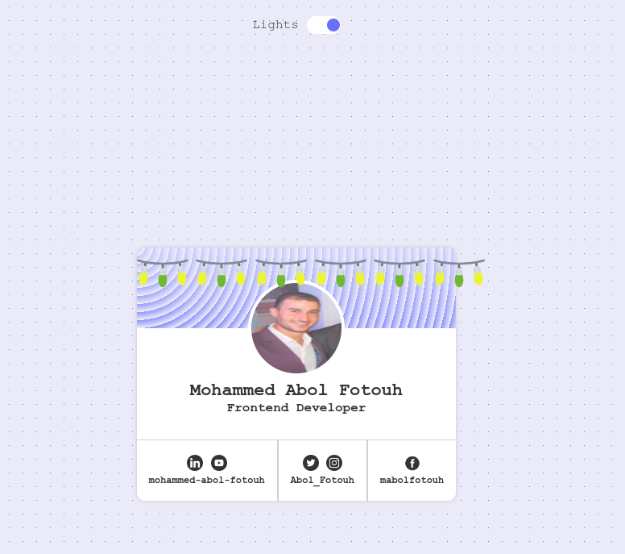
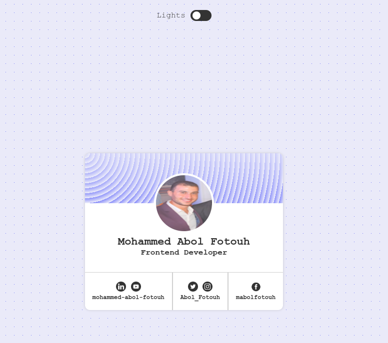

# Almdrsa - Profile Card Component

This is a solution to the Almdrsa Profile Card Component project in forntend course with Eng/Muhamed Abusrea.

## Table of contents

- [Overview](#overview)
  - [Screenshot](#screenshot)
  - [Links](#links)
- [My process](#my-process)
  - [Built with](#built-with)
- [Author](#author)
- [Acknowledgments](#acknowledgments)

## Overview

### Screenshot

 

### Links

- Solution URL: [https://github.com/Mohammed-Abol-Fotouh/profile-card-component](https://github.com/Mohammed-Abol-Fotouh/profile-card-component)
- Live Site URL: [https://mohammed-abol-fotouh.github.io/profile-card-component/](https://mohammed-abol-fotouh.github.io/profile-card-component/)

## My process

### Built with

- Semantic HTML5 markup
- Flexbox
- Responsive Design

## Author

- Personal website- [Mohammed Abol Fotouh](https://mohammed-abol-fotouh.github.io/personal-portfolio-almdrsa/)
- LinkedIn- [Mohammed Abol Fotouh](https://www.linkedin.com/in/mohammed-abol-fotouh/)
- Github- [Mohammed Abol Fotouh](https://github.com/Mohammed-Abol-Fotouh)

## Acknowledgments

Thanks to Almdrsa Family, Special thanks to Eng/Muhamed Abusrea and Eng/Ahmad Fathy
